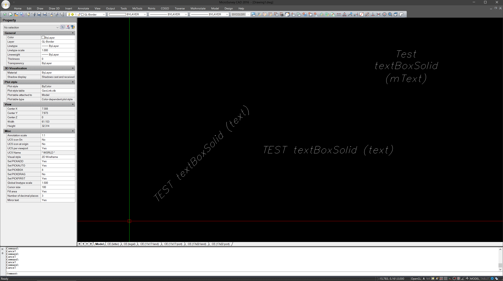

# AUTOCAD LISP script (for MicroSurvey CAD 2016)

Automatically place "solid" object behind TEXT (or mText):
- "Solid" has a rectangular shape with a small padding.
- "Solid" will be placed on the same layer as text.
- The color of the "solid" will be #19.
- Follows the rotation and the length of the text.

## How to use
### `Customization`
- "defun c:TextBoxSolid"defines command line
- "(setq pad 0.2)" defines padding

### `Load through CAD`
1) Use command "APPLOAD" and locate the desired *.lsp file.
2) Use command "TextBoxSolid" and select the text.

### `Setup auto load`
1) Locate icad.lsp
2) In my case: "C:\Program Files\MicroSurvey\MSCAD2016"
3) Add (load "...")
4) In my case: (load "C:/Program Files/MicroSurvey/MSCAD2016/TextBoxSolid.lsp")
